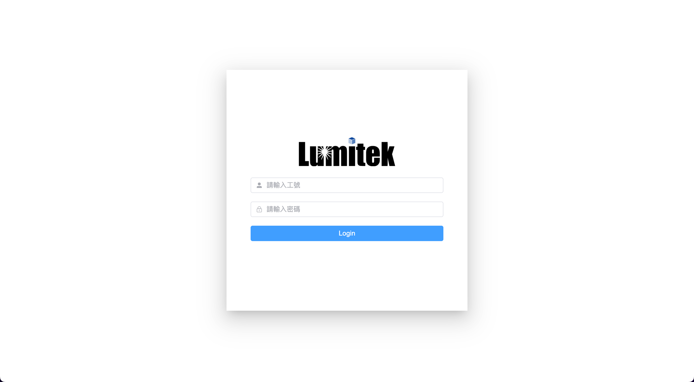
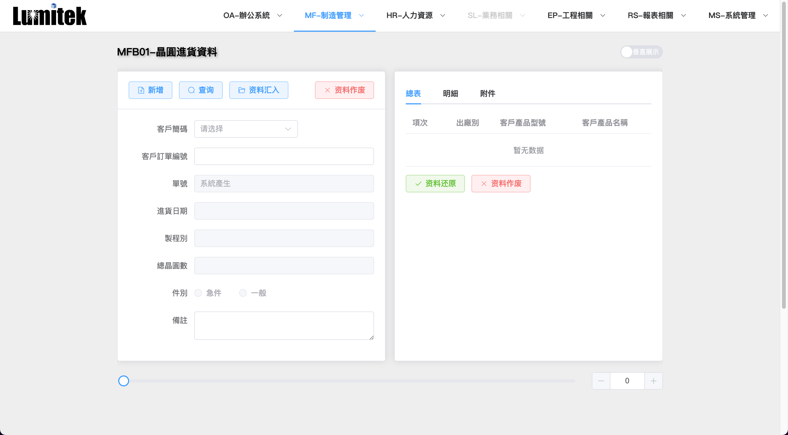

# 琉明系统
> Created by @Henry.Ge

项目依赖 Vue + Vite + Element Plus + 其他
## 开始
安装项目依赖
```
$ npm install
or
$ yarn install
```
启动项目
```
$ yarn dev
```
如果不需要使用后台数据只是预览页面，需要更改后台的配置文件

进入src目录下更改 `.env.development` 文件，修改 `VITE_USE_BACKEND_DATA_FLAG` 属性为 `false`
## 页面展示

