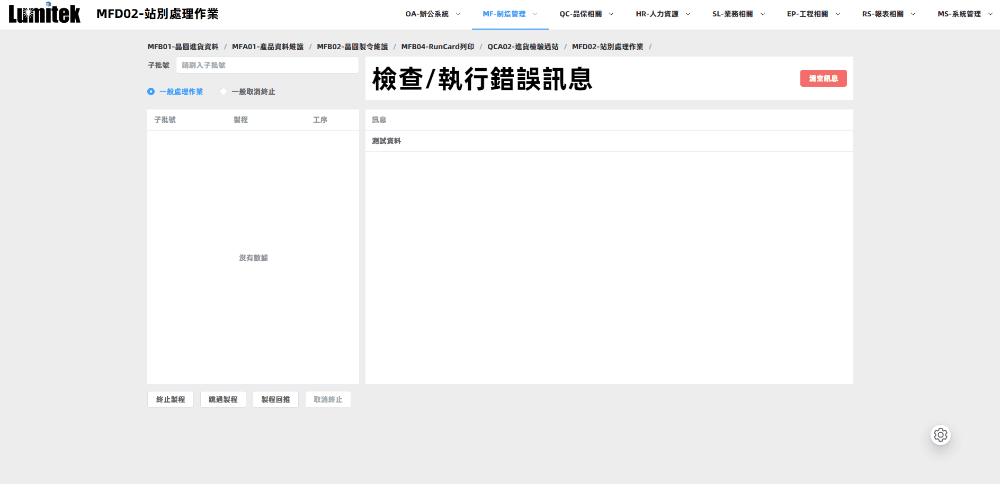
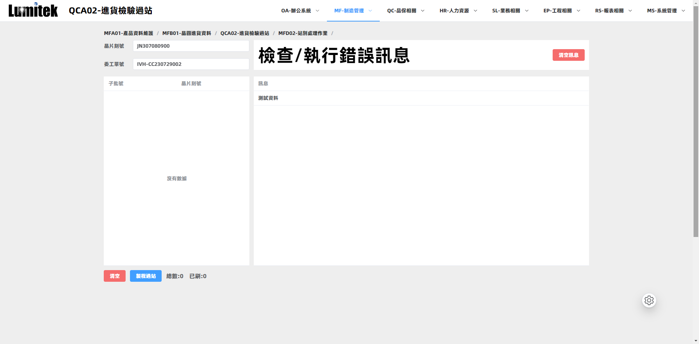
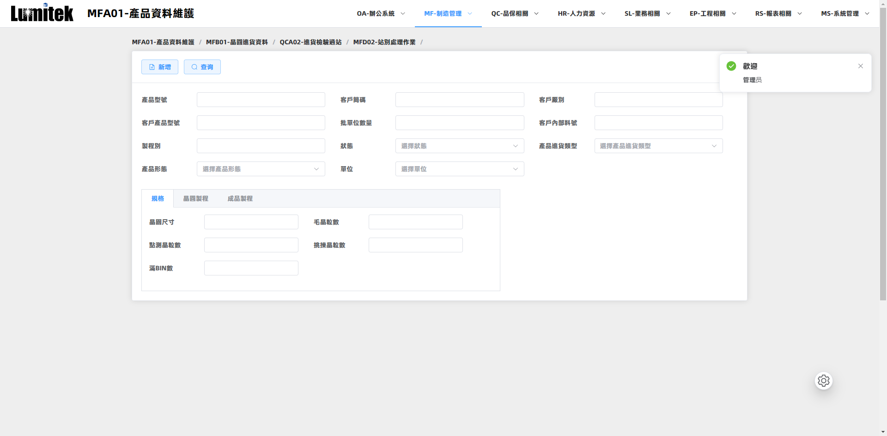
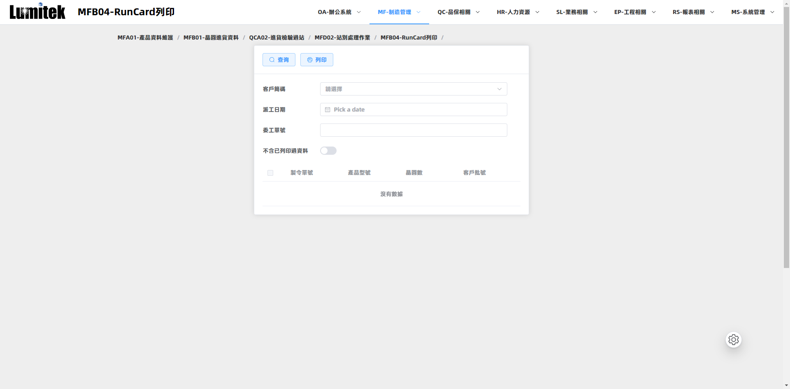

# 琉明ERP系统前端
> 琉明光电集成化的管理平台，将公司内部核心运营环节——财务、人力资源、生产、供应链、服务和采购等，纳入一个统一的系统中。


## 开始

安装项目依赖

```
$ npm install
or
$ yarn install
```

启动项目

```
$ yarn dev
or
$ npm run dev
```

## 现可使用功能
- MFB01-晶圆进货资料

  生产管理部使用，进货时可以选择手动填写晶圆资料，或选择晶圆资料文件来自动汇入
  
- MFA01-产品资料维护

  生产管理部根据单号和产品型号等查询晶圆的详细资料，可以对资料进行修改

- MFB02-晶圓製令維護

  查询更详细的晶圆资料，和对其附属资料的修改

- MFB04-RunCard列印

  晶圆出货时需要纸质资料，该功能可以渲染晶圆出货资料的PDF，并用浏览器自带的打印功能调用打印机打印

- QCA02-进货检验过站

  使用条码枪扫入晶片刻号，人员确认资料无误后过站
- MFD01-扣留处理作业

  校验晶圆过程中可能会扣留晶圆等待后续处理，该功能就是处理扣留的晶圆，进行放行等作业
- MFD02-站別处理作业

  使用条码枪扫入晶片刻号，可查看当前晶圆所在的站点，然后选择将其推入下一个站点或回推前一个站点等操作
- MFA09-HOLD類別維護

  晶圆扣留时需要选择扣留的类型和原因，该功能用来维护扣留的类型和原因

## 页面展示
面包屑的拖拽功能

QCA02

MFA01

RunCard列印


## 技术栈
- 使用Vite构建

主要技术
- Vue3
- JavaScript
- Element plus
- Pinia
- Prettier
- Vue Router
- animate.css

依赖库
- axios
- lodash
- vue-draggable-plus
- vue3-pdfjs
- mockjs